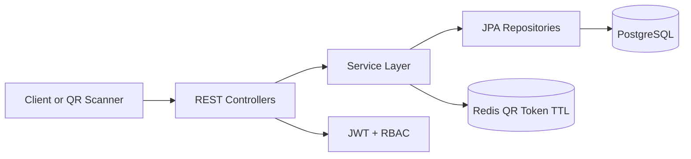

# Messatto

Messatto is a backend-focused QR-based mess management platform for college hostels. It replaces paper meal tokens with short-lived QR check-ins, tracks real-time veg/non-veg demand, records student mess attendance, reduces food wastage through better planning, and collects verified student feedback on food quality.

Resume positioning:

> Built Messatto, a QR-based mess management platform that digitized meal check-ins, tracked real-time veg/non-veg demand, recorded attendance, reduced paper token dependency, and enabled verified student feedback analytics for food quality transparency.

## Tech Stack

- Java 21
- Spring Boot 3
- Spring Security with JWT
- PostgreSQL with Flyway migrations
- Redis for short-lived QR token validation
- Docker and Docker Compose
- JUnit 5, Mockito, Testcontainers
- Swagger/OpenAPI via springdoc

## Actors

- `STUDENT`: login, view today's meals, scan veg/non-veg QR, view attendance history, submit verified feedback.
- `MESS_ADMIN`: login, create meals, generate meal QR tokens, view live counts, view feedback summary, export reports.
- `SUPER_ADMIN`: create students, mess admins, and other super admins.

## Architecture



Project layout:

```text
src/main/java/com/messatto
  config        Security, OpenAPI, seed data, beans
  controller    REST endpoints
  domain        JPA entities and enums
  dto           Request/response records
  exception     Global exception handling
  repository    Spring Data repositories
  security      JWT filter, principal, user details
  service       Business rules and orchestration
```

## Core Business Rules

- QR tokens are randomly generated, SHA-256 hashed in PostgreSQL, and stored in Redis with TTL.
- Student scans are accepted only during the meal date and time window.
- One attendance record per student per meal is enforced by `uk_attendance_student_meal`.
- Re-scanning the same meal choice is idempotent and returns the existing attendance.
- Scanning a different choice after attendance is rejected.
- Feedback requires attendance for that meal.
- One feedback record per student per meal is enforced by `uk_feedback_student_meal`.
- Anonymous feedback hides the student name in admin summaries.

## Run Locally

Start PostgreSQL, Redis, and the backend:

```bash
docker compose up --build
```

API base URL:

```text
http://localhost:8080
```

Swagger UI:

```text
http://localhost:8080/swagger-ui.html
```

Demo super admin credentials (local development only):

```text
email: superadmin@messatto.local
password: SuperAdmin@123
```

Use a strong `JWT_SECRET` in real deployments.

## Main API Examples

Login:

```bash
curl -X POST http://localhost:8080/auth/login \
  -H "Content-Type: application/json" \
  -d '{"email":"superadmin@messatto.local","password":"SuperAdmin@123"}'
```

Create a mess admin or student:

```bash
curl -X POST http://localhost:8080/super-admin/users \
  -H "Authorization: Bearer <SUPER_ADMIN_TOKEN>" \
  -H "Content-Type: application/json" \
  -d '{
    "name":"Student One",
    "email":"student1@college.edu",
    "rollNumber":"CS-001",
    "password":"Student@123",
    "role":"STUDENT",
    "hostel":"Hostel A"
  }'
```

Create a meal:

```bash
curl -X POST http://localhost:8080/admin/meals \
  -H "Authorization: Bearer <MESS_ADMIN_TOKEN>" \
  -H "Content-Type: application/json" \
  -d '{
    "mealDate":"2026-06-19",
    "mealType":"LUNCH",
    "vegMenu":"Rice, dal, paneer, salad",
    "nonVegMenu":"Rice, dal, chicken curry, salad",
    "startTime":"12:30:00",
    "endTime":"14:30:00"
  }'
```

Generate a QR token:

```bash
curl -X POST http://localhost:8080/admin/meals/<MEAL_ID>/qr \
  -H "Authorization: Bearer <MESS_ADMIN_TOKEN>" \
  -H "Content-Type: application/json" \
  -d '{"mealChoice":"VEG","ttlSeconds":900}'
```

Scan attendance:

```bash
curl -X POST http://localhost:8080/attendance/scan \
  -H "Authorization: Bearer <STUDENT_TOKEN>" \
  -H "Content-Type: application/json" \
  -d '{"token":"<QR_TOKEN_OR_PAYLOAD>"}'
```

Submit feedback:

```bash
curl -X POST http://localhost:8080/feedback \
  -H "Authorization: Bearer <STUDENT_TOKEN>" \
  -H "Content-Type: application/json" \
  -d '{
    "mealId":"<MEAL_ID>",
    "tasteRating":4,
    "hygieneRating":5,
    "quantityRating":4,
    "serviceRating":5,
    "comment":"Fresh food and fast service",
    "anonymous":true
  }'
```

Admin dashboard and reports:

```bash
curl "http://localhost:8080/admin/dashboard/live?date=2026-06-19&mealType=LUNCH" \
  -H "Authorization: Bearer <MESS_ADMIN_TOKEN>"

curl "http://localhost:8080/admin/reports/daily?date=2026-06-19&format=csv" \
  -H "Authorization: Bearer <MESS_ADMIN_TOKEN>"

curl "http://localhost:8080/admin/feedback/summary?mealId=<MEAL_ID>" \
  -H "Authorization: Bearer <MESS_ADMIN_TOKEN>"
```

## Testing

Run all tests:

```bash
mvn test
```

The test suite includes:

- Mockito unit tests for attendance idempotency and duplicate-choice rejection.
- Testcontainers integration test using real PostgreSQL and Redis containers for the core login-to-feedback flow. It is skipped automatically on machines without Docker.

## Database

Flyway migration:

```text
src/main/resources/db/migration/V1__init_schema.sql
```

Important database constraints:

- `uk_meals_date_type`
- `uk_attendance_student_meal`
- `uk_feedback_student_meal`
- `uk_users_email_lower`
- `uk_users_roll_number`
